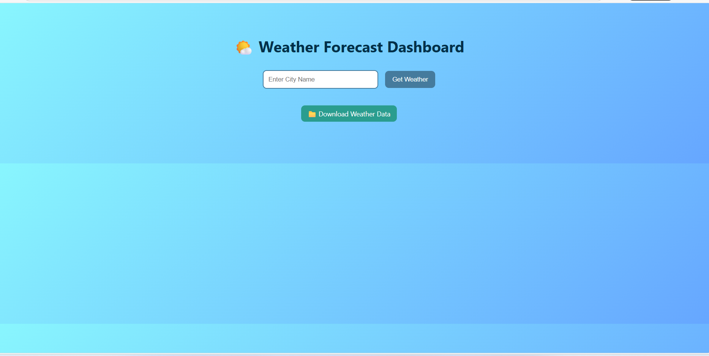
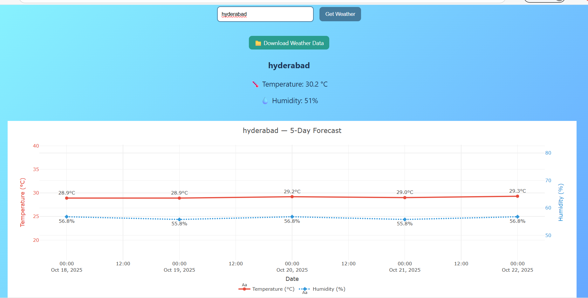

# 🌦️ Weather-Data-Dashboard-with-Predictive-Aalytics
The Weather Forecast Dashboard is a sleek and interactive Flask web application that allows users to fetch real-time weather information for any city and provides a 5-day forecast using machine learning (Linear Regression). This application leverages the OpenWeatherMap API for live weather data and visualizes results with interactive Plotly charts, displaying both temperature and humidity trends. It also stores data automatically in a CSV file to continuously improve predictions over time. With a clean and modern interface built using HTML, CSS, and JavaScript, users can quickly check the weather and view predictive trends in a visually appealing and intuitive format.

---

## 🚀 Features

- ✅ Fetches current weather (temperature & humidity) for any city
- ✅ Uses Linear Regression (scikit-learn) to predict 5-day weather trends
- ✅ Stores data in CSV automatically for continuous learning
- ✅ Interactive charts (Temperature & Humidity) using Plotly
- ✅ Option to download stored weather data
- ✅ Clean, modern UI built with HTML, CSS, and JavaScript

---

## 🗂️ Project Structure

```text
weather-forecast-dashboard/
│
├── app.py                  # Flask backend
├── requirements.txt        # Python dependencies
│
├── templates/
│   └── index.html          # Frontend HTML
│
├── static/
│   ├── style.css           # Styling
│   └── script.js           # Frontend logic
│
├── weather_data.csv        # Auto-created data file
└── README.md               # Documentation
```

---

## ⚙️ Installation & Setup

1️⃣ **Clone this repository**  

```
git clone https://github.com/<your-username>/weather-forecast-dashboard.git
cd weather-forecast-dashboard
```

2️⃣ **Install dependencies**

```
pip install -r requirements.txt
```

3️⃣ **Add your OpenWeatherMap API key**

```
API_KEY = "YOUR_API_KEY"
```

4️⃣ **Run the Flask app**

```
python app.py
```

---

## 🧩 Tech Stack

| Layer           | Technology                        |
|-----------------|-----------------------------------|
| Backend         | Flask                             |
| Frontend        | HTML, CSS, JavaScript             |
| Data Processing | Pandas                            |
| Machine Learning| scikit-learn (LinearRegression)   |
| Visualization   | Plotly.js                         |
| API             | OpenWeatherMap                    |

---

## 🧠 How It Works

1. The user enters a city name.  
2. Flask fetches live weather data from OpenWeatherMap API.  
3. Data is stored in `weather_data.csv`.  
4. Linear Regression models predict the next 5 days of **temperature** and **humidity**.  
5. Forecast is visualized in an interactive Plotly chart with dual Y-axes.

---

## 🖼️ Example Output

### 1️⃣ Enter City (Input Screen)



*This shows the initial interface of the Weather Forecast Dashboard. Users can enter the name of a city (e.g., Hyderabad) to fetch the current weather and forecast data.*

### 2️⃣ Weather & Forecast Results



*This displays the results after entering a city. It shows the current temperature and humidity, along with a 5-day forecast generated using Linear Regression. The interactive Plotly charts visualize temperature (°C) and humidity (%) trends for better analysis.*

---


   
